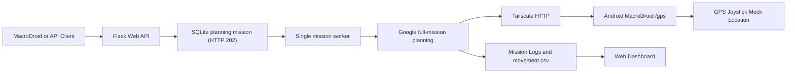

# Mock GPS Follow Live Nav

Mock GPS Follow Live Nav 是一個供自有應用程式與私有測試環境使用的 GPS 模擬與即時導航跟隨系統。Flask web、獨立 mission worker 與 SQLite 共同管理 Google Maps 路線、連續 GPS 座標及 Tailscale 手機傳送。請勿用於偽造出勤、規避第三方服務控制或違反適用法律與服務條款的用途。

## 功能

- 任務控制：使用 `/start_task` 開始任務，使用 `/stop_task` 停止伺服器端任務
- GPS 推送：將 `lat` / `lng` 傳送到手機端 MacroDroid `/gps`；手機 HTTP 傳送與 movement logging 完全解耦
- 路線規劃：使用 Google Maps Directions API 取得步行、大眾運輸與機車路線
- 導航歷史：保留每次 Google Directions 規劃的交通型態、車種、路線、站點、距離與時間資訊
- 交通模式：支援 `walking`、`transit`、`motorcycle`
- 大眾運輸：`transit_type` 可指定 `AUTO`、`MRT` 或 `BUS`
- 位置維持：任務完成後保持最後位置，直到停止任務
- 任務歷史：每次任務建立獨立 log session 與 `movement.csv`
- 歷史分頁：選定 session 後開啟獨立頁面，地圖、狀態、路線、Navigation、CSV 與所有 log 都固定使用該 session
- Web 監控：地圖、任務狀態、最後座標、路線、Log 與任務歷史
- Web/Worker 分離：Web 只接受與查詢任務，單一 worker 執行導航
- SQLite：持久化任務、ETA、路線 revision、錯誤及手機健康狀態
- ETA 配速：任務開始前規劃全程，MRT 停站後動態補速但不超過 Google nominal speed 的 1.35 倍

## 專案結構

```text
mock-gps-follow-live-nav/
├─ start_local.py
├─ requirements.txt
├─ requirements-dev.txt
├─ requirements-lock.txt
├─ README.md
├─ LICENSE
├─ .env.example
├─ macrodroid-example.category
├─ .github/workflows/ci.yml
├─ .vscode/
│  ├─ launch.json
│  ├─ tasks.json
│  └─ settings.json
├─ tests/
└─ mock_gps/
   ├─ config.py
   ├─ db.py
   ├─ logger.py
   ├─ history.py
   ├─ api/
   ├─ core/
   ├─ resources/settings.json
   ├─ static/
   └─ templates/
```

## 系統流程



## 環境設定

建立 Python 環境：

```bash
python -m venv .venv
.venv\Scripts\activate
pip install -r requirements.txt
```

建立 `.env`：

```bash
copy .env.example .env
```

`.env` 範例：

```ini
GOOGLE_MAPS_API_KEY="YOUR_GOOGLE_MAPS_API_KEY"
PHONE_TAILSCALE_IP="100.x.x.x"
API_SECRET_KEY="replace_with_a_long_random_secret"
API_ACCESS_KEY="replace_with_a_different_random_secret"
FLASK_SESSION_SECRET="replace_with_another_random_secret"
BIND_HOST="127.0.0.1"
FLASK_PORT=5050
TZ="Asia/Taipei"
```

`API_SECRET_KEY` 必須有值，長度不限；`API_ACCESS_KEY` 與 `FLASK_SESSION_SECRET` 可省略並沿用它，也可以另外設定。MacroDroid 任務控制使用實際生效的 `API_ACCESS_KEY`。

## 安裝

專案不需要 Docker，只需要一個 Python 虛擬環境（3.10 以上皆可）。第一次執行：

```bash
py -3.12 -m venv .venv
.venv\Scripts\python -m pip install -r requirements-lock.txt
```

要跑測試與 lint 時再裝開發相依：

```bash
.venv\Scripts\python -m pip install -r requirements-dev.txt
```

用 VS Code 開啟專案資料夾時，`.vscode/tasks.json` 會在啟動前自動完成建立 venv 與安裝執行相依這兩步，不必手動執行。

## 啟動

用 VS Code 開啟專案資料夾後按 `F5`，選擇 `Mock GPS Follow Live Nav (web + worker)`。或在終端機執行：

```bash
.venv\Scripts\python start_local.py
```

`start_local.py` 是單一進程：Flask dashboard 跑在背景執行緒，mission worker 跑在主執行緒。兩者共用同一個 SQLite 連線池與 log 設定。

停止時按 `Ctrl+C`，或按 VS Code 的停止鍵。整個進程結束，不會留下任何背景服務。目前仍在 planning、queued、running 或 degraded 的任務會標記為 `interrupted`，下次啟動不會續跑，必須由使用者重新傳送指令。SQLite、歷史任務、movement CSV、logs 與封存檔都會保留。

即使進程被強制終止（例如按 VS Code 停止鍵而非 Ctrl+C），下次啟動時 worker 取得 lease 後會自動把殘留在 `running` 的任務回收成 `interrupted`，並在 log 記錄 `Reclaimed N orphaned mission(s) on worker startup`。

重啟後 Dashboard **不會**顯示上次被中斷的任務：狀態回到 `IDLE`，地圖上的規劃路線與軌跡都清空。該次執行的完整紀錄仍保留在任務歷史中，可從歷史頁面查看。任務表單則仍保留上次送出的站點，方便直接重新送出。

`completed`、`stopped`、`aborted`、`failed` 的任務不受影響，重啟後仍會顯示——那些是使用者主動造成的結果，需要被看到。

## 網路存取

`BIND_HOST` 是唯一的網路設定，預設 `127.0.0.1`（僅限本機）。

要讓手機透過 Tailscale 連入 Dashboard 時，填入本機的 Tailscale IP：

```ini
BIND_HOST="100.x.x.x"
```

此時服務會**同時**監聽 `127.0.0.1` 與該 Tailscale IP，兩個網址都可用：

```text
http://127.0.0.1:5050/map      # 本機
http://100.x.x.x:5050/map      # 手機經 Tailscale
```

`BIND_HOST` 只是「額外開放的介面」，`127.0.0.1` 永遠保留。若只綁單一位址，本機的 `127.0.0.1` 會連不上——這是 socket 綁定的行為，不是設定錯誤。

不要填 `0.0.0.0`。那會把未加密的 Dashboard 暴露在整個 LAN 上；服務一律以 HTTP 提供，session cookie 沒有 `Secure` 旗標，會以明文傳輸。

Tailscale 未連線時，綁定該 IP 會失敗並印出提示；先確認 Tailscale 已連上再啟動。

預設網址：

```text
http://localhost:5050/map
http://<BIND_HOST>:5050/map  # Tailscale HTTP
```

進入 `/map` 時會導向 `/login`，請輸入 `.env` 中的 `API_SECRET_KEY`。

## Tailscale

PC 與 Android 手機需要登入同一個 Tailscale tailnet。PC 透過手機的 Tailscale IP 呼叫 MacroDroid HTTP Server，手機也可透過 PC 的 Tailscale IP 呼叫任務控制 API。

PC 端設定——把 `BIND_HOST` 填成本機的 Tailscale IP，服務才會在該位址上聽：

```ini
BIND_HOST="100.x.x.x"
```

手機端設定——PC 要送座標過去的手機 Tailscale IP：

```ini
PHONE_TAILSCALE_IP="100.x.x.x"
```

手機端的 MacroDroid 則把 `g_server_url` 指向 PC 的 Tailscale IP，`.env` 不需要另外記錄它。

PC 會送出座標到：

```text
http://<PHONE_TAILSCALE_IP>:8080/gps?lat=25.xxxxxxx&lng=121.xxxxxxx
```

服務只提供 HTTP，沒有內建 HTTPS，請只在 Tailscale 或可信任內網使用。Tailscale 本身已對節點之間的流量加密。

## Android MacroDroid

專案根目錄提供 `macrodroid-example.category`，可匯入 MacroDroid 作為範例分類。匯入後請修改：

- 區域變數 `g_server_url`（Mission Controller 與 Stop GPS 各有一份，兩邊都要改）
- HTTP Request header `API-ACCESS-KEY`
- MacroDroid HTTP Server port
- GPS Joystick / Mock Location 權限

### Mission Controller

用途：在手機上輸入任務資料，送到 PC 的 `/start_task`。

- Method：`POST`
- URL：`{lv=g_server_url}/start_task`
- Header：`API-ACCESS-KEY: <API_ACCESS_KEY>`
- Content-Type：`application/json`
- Timeout：30 秒即可；伺服器驗證後立即回 `202`，Google 路線由 worker 非同步規劃

任務 JSON：

```json
{
  "init_loc": "25.047800,121.517000",
  "stops": [
    {
      "name": "Taipei Main Station",
      "coord": "25.047800,121.517000",
      "mode": "transit",
      "transit_type": "MRT",
      "wait_time": "09:30",
      "skip_if_late": true
    }
  ]
}
```

### Move GPS

用途：手機端接收 PC 傳來的座標，並轉發給 GPS Joystick。

- Method：`GET`
- Port：`8080`
- Path / Identifier：`gps`
- Query params dictionary：`http_params`
- Query params：`lat`、`lng`

呼叫格式：

```text
http://<PHONE_TAILSCALE_IP>:8080/gps?lat=25.xxxxxxx&lng=121.xxxxxxx
```

### Stop GPS

用途：從手機呼叫 PC 的 `/stop_task`，停止伺服器端任務。

- Method：`POST`
- URL：`{lv=g_server_url}/stop_task`
- Header：`API-ACCESS-KEY: <API_ACCESS_KEY>`

手機端會停留在最後一次收到的 Mock Location。

## 任務 API

任務控制 API 必須帶入：

```http
API-ACCESS-KEY: <API_ACCESS_KEY>
Content-Type: application/json
```

### 開始任務

```http
POST /start_task
```

成功回應為 `202 Accepted`，任務先進入 `planning`；規劃完成後由 worker 開始執行。規劃失敗時狀態改為 `failed`，原因可由系統狀態 API 與 Dashboard 的 `last_error` 查看。

欄位說明：

| 欄位 | 必填 | 說明 |
|---|---:|---|
| `init_loc` | 是 | 初始座標，格式為 `lat,lng` |
| `stops` | 是 | 任務站點陣列，至少 1 筆，最多 50 筆 |
| `stops[].name` | 是 | Google Maps 可辨識的地名或地址 |
| `stops[].mode` | 是 | `walking`、`transit`、`motorcycle` |
| `stops[].transit_type` | 否 | `AUTO`、`MRT`、`BUS` 或空字串，只有 `transit` 使用 |
| `stops[].wait_time` | 否 | `HH:MM`，出發前等待時間 |
| `stops[].skip_if_late` | 否 | 若已超過等待時間，是否略過等待 |
| `stops[].coord` | 否 | 最終精準對位座標，格式為 `lat,lng` |

### 停止任務

```http
POST /stop_task
```

## Web 監控

```text
http://localhost:5050/map
```

網頁可查看：

- 任務狀態：`idle`、`planning`、`queued`、`running`、`degraded`、`completed`、`interrupted`、`aborted`、`failed`
- 已完成站點 / 總站點
- 目前目標
- 最後送出的座標
- Tailscale P2P 目標
- 初始／最新 Google ETA、schedule debt 與手機健康狀態
- Google Maps 規劃路線
- Google Maps 導航歷史詳細資訊
- 即時 movement CSV
- 系統、路線、錯誤、安全 log
- 任務歷史列表

選取歷史 session 後會開啟 `/history/<date>/<session>` 新分頁。原 LIVE Dashboard 不會切換模式或停止輪詢；History 分頁中的所有資料按鈕只讀取 URL 指定的 session，缺少資料時不會退回顯示 LIVE 資料。CSV 按鈕以分頁資料表顯示內容，不提供原始檔下載。

網頁不顯示電腦硬體資訊。

## 監控 API

監控 API 可使用登入 session 或 `API-ACCESS-KEY`。

| API | 說明 |
|---|---|
| `GET /api/system_status` | 任務狀態、最後座標、P2P 目標、設定、log session |
| `GET /api/planned_route?route_token=<mission:revision>` | 目前規劃路線座標；版本未變回 304 |
| `GET /api/navigation_history` | 目前任務的導航歷史詳細資訊 |
| `GET /api/movements/current?offset=N&limit=250` | 以 byte cursor 分頁讀取目前 movement JSON |
| `GET /api/log/all` | 目前任務完整 log |
| `GET /api/log/route` | 路線 log |
| `GET /api/log/error` | warning / error log |
| `GET /api/log/security` | 安全事件 log |
| `GET /api/mission` | 目前任務資料 |
| `GET /api/history` | 任務歷史列表 |
| `GET /api/history/<date>/<session>/status` | 固定 session 的任務狀態與 ETA |
| `GET /api/history/<date>/<session>/planned_route` | 固定 session 的規劃路線 |
| `GET /api/history/<date>/<session>/navigation` | 固定 session 的 Navigation 詳細資料 |
| `GET /api/history/<date>/<session>/movements?offset=N&limit=250` | 歷史或封存任務 movement JSON |
| `GET /api/history/<date>/<session>/log/<log_name>` | 歷史任務 log |

movement record 的 `sequence` 是 session 內單調遞增列序號；`next_offset` 則是伺服器端 byte cursor，兩者不可混用。

## Log 系統

常駐 log：

```text
logs/app.log     # start_local.py（web + worker 同一進程）
```

每次任務會建立獨立 session：

```text
logs/YYYY-MM-DD/HH-MM-SS/
├─ all.log
├─ route.log
├─ error.log
├─ security.log
├─ mission.json
└─ movement.csv
```

`movement.csv` 欄位：

```csv
Sequence,Timestamp,Latitude,Longitude,Action,Note,TimestampISO,DeltaSeconds,DistanceMeters
```

- `Sequence`：session 內單調遞增的 movement 列序號。
- `Timestamp`：以 UTC 儲存，含毫秒與 `Z` 標記；Dashboard 依 `TZ` 轉換後顯示。
- `TimestampISO`：aware UTC ISO 時間，含毫秒；Dashboard 依 `TZ` 轉換後顯示。
- `DeltaSeconds`：與上一筆實際紀錄的時間差，單位秒。
- `DistanceMeters`：與上一筆實際紀錄座標的距離，單位公尺。

移動期間 CSV 以真實系統秒數記錄。任務完成後仍每秒傳送終點座標給手機，但 CSV 只在完成時及每 60 秒寫一筆 heartbeat。超過 30 日的 session 會在驗證 ZIP 完整性後刪除原目錄，ZIP 永久保留並可由 Dashboard 按需解壓回放。

## `settings.json`

設定檔位置：

```text
mock_gps/resources/settings.json
```

主要設定：

| 設定 | 預設 | 說明 |
|---|---:|---|
| `mrt_station_groups` | 分組站點資料 | 依路線整理的台北捷運站座標 |

程式啟動時會自動將 `mrt_station_groups` 攤平成內部使用的 MRT 到站偵測資料庫。

## 開發

`start_local.py` 是唯一的進入點，把 web 與 worker 跑在同一個進程，適合日常開發與除錯：VS Code 的中斷點在兩邊都有效。

同一個資料夾一次只能跑一個實例——`data/instance.lock` 會擋下第二個，worker lease 也只允許一個持有者。

測試：

```bash
.venv\Scripts\python -m pip install -r requirements-dev.txt
.venv\Scripts\python -m pytest
.venv\Scripts\python -m ruff check .
```

## 資訊安全

- 任務控制 API 必須使用獨立的 `API_ACCESS_KEY`
- Web dashboard 需登入或使用有效 API key
- API key 使用 constant-time comparison
- Flask session cookie 一律設定 `HttpOnly`、`SameSite=Strict`；因為服務以 HTTP 提供，不啟用 `Secure`
- Log 不記錄 API key
- Response 加入安全標頭：
  - `X-Content-Type-Options: nosniff`
  - `X-Frame-Options: DENY`
  - `Referrer-Policy: no-referrer`
  - `Cache-Control: no-store`
- 建議只在 Tailscale 或可信任網路中使用

## GitHub 上傳前檢查

可上傳的範例與設定：

- `.env.example`
- `macrodroid-example.category`
- `.vscode/launch.json`、`.vscode/tasks.json`、`.vscode/settings.json`
- `mock_gps/resources/settings.json`

不應上傳的本機資料：

- `.env`
- `logs/`
- `data/`
- `*.log`
- `*.csv`
- `.venv/`
- `AI.md`
- 其他 IDE 本機設定

## 疑難排解

| 問題 | 檢查項目 |
|---|---|
| 無法啟動伺服器 | 檢查 `.env` 是否存在，`API_SECRET_KEY` 是否已設定 |
| Google Maps 沒有路線 | 檢查 `GOOGLE_MAPS_API_KEY` 與 Directions API 是否啟用 |
| 手機沒收到座標 | 檢查 Tailscale、`PHONE_TAILSCALE_IP`、MacroDroid `/gps`、手機防火牆 |
| MacroDroid 任務送出失敗 | 檢查 `g_server_url`、`API-ACCESS-KEY`、Tailscale 連線 |
| `/api/*` 回傳 401 | 重新登入 `/login` 或確認 `API-ACCESS-KEY` |
| 地圖空白 | 檢查本機 vendor 靜態資源與瀏覽器 console |
| 沒有歷史 CSV | 確認任務已開始，並檢查 `logs/YYYY-MM-DD/HH-MM-SS/` |

## 驗證指令

```bash
python -m compileall -q mock_gps start_local.py
python -m pytest
ruff check .
```

## 授權

本專案採用 MIT License，詳細內容請見 [LICENSE](LICENSE)。

## 作者

Yang Sheng-Wen

[https://github.com/YangShengWen-0505](https://github.com/YangShengWen-0505)
